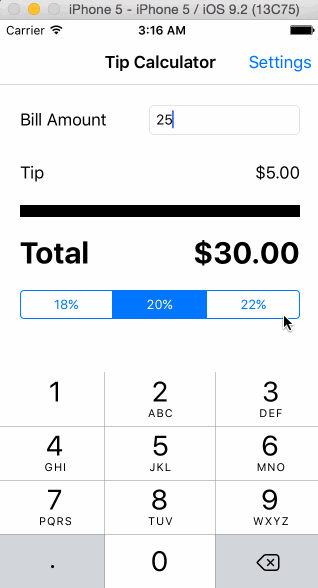

# Tip Calculator Demo

This is a Tip Calculator Demo.

Time spent: 2 hours spent in total

Completed user stories:

* [x] Required: Create a basic Tip Calculator with pre-defined tip percentages: 18%, 20%, 22%.
* [x] Required: Settings page that saves the default tip percentage and persist it.

Walkthrough of tip calculator experience:

